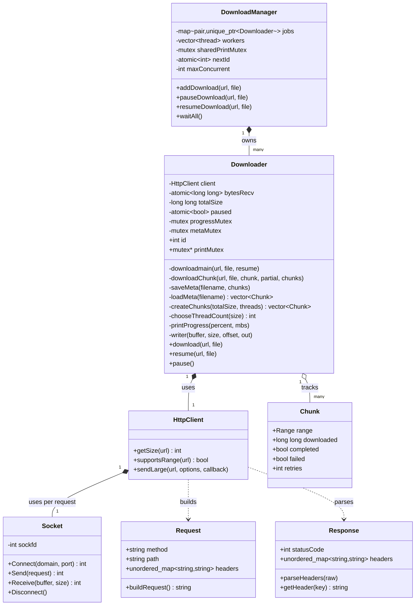

# Internet Download Manager (IDM)

A multi-threaded, segmented download manager built from scratch in C++ using raw POSIX sockets and manual HTTP/1.1 parsing — no libcurl, no third-party HTTP libraries. Supports parallel chunked downloads, pause/resume, automatic retry with backoff, stall detection, and a concurrent download queue with live per-download progress bars.

## Features

- **Raw HTTP/1.1 client** — hand-rolled request building and response parsing over POSIX sockets (`Socket`, `Request`, `Response`), including redirect following (301/302).
- **Segmented parallel downloads** — splits a file into N chunks via HTTP `Range` requests, downloaded concurrently on separate threads.
- **Retry with backoff** — each chunk retries independently on failure, up to `MAXRETRIES`, with linearly increasing backoff between attempts.
- **Stall detection** — a per-chunk watchdog thread monitors for stalled transfers (no progress for 5s) and triggers a retry rather than hanging indefinitely.
- **True in-process pause/resume** — pausing mid-download safely interrupts in-flight transfers (not just between attempts), persists exact progress per chunk to a `.meta` file, and resuming picks up from the last saved byte offset rather than restarting.
- **Resume-safe file handling** — a resumed download reopens the output file non-destructively (no truncation), unlike a fresh download which pre-allocates and truncates as expected.
- **Concurrent download queue** (`DownloadManager`) — manages multiple simultaneous downloads, each with an independent `Downloader` instance, and renders each one's progress bar on its own fixed terminal row using ANSI cursor positioning, coordinated by a shared mutex across instances.
- **Adaptive thread count** — `chooseThreadCount()` selects a thread count based on file size (see [Benchmarking](#benchmarking) below for how these thresholds were derived, and their limitations).

## Architecture



**Threading model per download**: `Downloader::download()` splits the file into chunks and spawns one thread per chunk (`downloadChunk`). Each chunk thread runs its own watchdog thread for stall detection, and writes directly into shared offsets of the same output file (safe, since each chunk owns a disjoint byte range). Progress and meta-file writes are synchronized via `progressMutex` and `metaMutex` respectively.

**Threading model across downloads**: `DownloadManager` owns one `Downloader` per queued job, each running its `download()`/`resume()` call on its own thread. All `Downloader` instances share a single `printMutex` so their progress bars can be rendered on independent terminal rows without interleaving.

## Building

```bash
g++ -std=c++17 -pthread main.cpp -o downloader
```

## Usage

```cpp
DownloadManager manager(/* maxConcurrent, not yet enforced — see Known Limitations */);

manager.addDownload("https://example.com/file.zip", "output.zip");
manager.addDownload("https://example.com/other.zip", "output2.zip");

manager.waitAll();
```

Pause and resume a specific queued download:
```cpp
manager.pauseDownload(url, file);
manager.resumeDownload(url, file);
```

## Benchmarking

Thread-count-vs-file-size behavior was benchmarked against a public speedtest server (Tele2). The server proved too noisy for reliable precision — server-side stalls and inconsistent throughput contaminated a meaningful fraction of runs, including several severe outliers our stall-detection watchdog didn't catch (a known gap: the watchdog's 5-second no-progress threshold missed slower, non-stalling degradation).

One consistent finding held across trials: **below roughly 5–10MB, thread count had no measurable effect on transfer time** — per-thread overhead dominates at that scale. Above that, results trended toward higher thread counts winning by median at larger sizes (e.g. 64 threads outperforming lower counts by a clear margin at 100MB), but the noise made pinning exact per-size thresholds unreliable.

Cleaner benchmarking against a dedicated, non-public server is planned to finalize `chooseThreadCount()`'s thresholds with confidence.

## Known Limitations

- `DownloadManager`'s `maxConcurrent` parameter is not yet enforced — all queued downloads launch immediately rather than being scheduled against a concurrency cap.
- No TLS/HTTPS support — the raw-socket `HttpClient` only speaks plain HTTP.
- Progress display assumes a fixed set of terminal rows reserved at queue-start; interleaving other terminal output while downloads are active will misalign the display.

## Roadmap

- Enforce `maxConcurrent` with a proper worker-pool/semaphore pattern.
- Re-derive `chooseThreadCount()` thresholds against a clean, low-noise server.
- Basic TLS support via OpenSSL.
