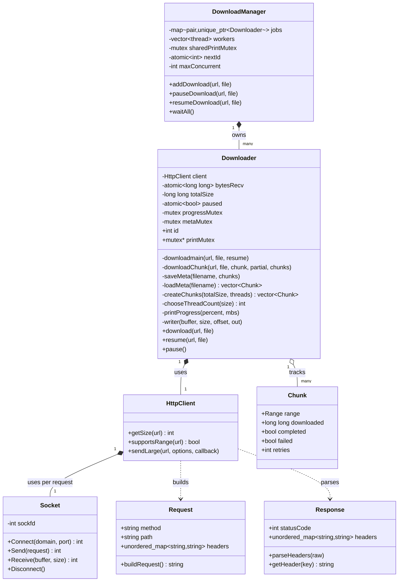

# Internet Download Manager (IDM)

A multi-threaded, segmented download manager built from scratch in C++ using raw POSIX sockets and manual HTTP/1.1 parsing — no libcurl, no third-party HTTP libraries. Supports parallel chunked downloads, pause/resume, automatic retry with backoff, stall detection, and a concurrent download queue with live per-download progress bars.

## Features

- **Raw HTTP/1.1 client** — hand-rolled request building and response parsing over POSIX sockets (`Socket`, `Request`, `Response`), including redirect following (301/302).
- **Segmented parallel downloads** — splits a file into N chunks via HTTP `Range` requests, downloaded concurrently on separate threads.
- **Retry with backoff** — each chunk retries independently on failure, up to `MAXRETRIES`, with linearly increasing backoff between attempts.
- **Stall detection** — a per-chunk watchdog thread monitors for stalled transfers (no progress for 5s) and triggers a retry rather than hanging indefinitely.
- **True in-process pause/resume** — pausing mid-download safely interrupts in-flight transfers (not just between attempts), persists exact progress per chunk to a `.meta` file, and resuming picks up from the last saved byte offset rather than restarting.
- **Resume-safe file handling** — a resumed download reopens the output file non-destructively (no truncation), unlike a fresh download which pre-allocates and truncates as expected.
- **Concurrent download queue** (`DownloadManager`) — manages multiple simultaneous downloads, each with an independent `Downloader` instance, and renders each one's progress bar on its own fixed terminal row using ANSI cursor positioning, coordinated by a shared mutex across instances.
- **Adaptive thread count** — `chooseThreadCount()` selects a thread count based on file size (see [Benchmarking](#benchmarking) below for how these thresholds were derived, and their limitations).

## Architecture



**Threading model per download**: `Downloader::download()` splits the file into chunks and spawns one thread per chunk (`downloadChunk`). Each chunk thread runs its own watchdog thread for stall detection, and writes directly into shared offsets of the same output file (safe, since each chunk owns a disjoint byte range). Progress and meta-file writes are synchronized via `progressMutex` and `metaMutex` respectively.

**Threading model across downloads**: `DownloadManager` owns one `Downloader` per queued job, each running its `download()`/`resume()` call on its own thread. All `Downloader` instances share a single `printMutex` so their progress bars can be rendered on independent terminal rows without interleaving.

## Building

```bash
g++ -std=c++17 -pthread main.cpp -o downloader
```

## Usage

```cpp
DownloadManager manager(/* maxConcurrent, not yet enforced — see Known Limitations */);

manager.addDownload("https://example.com/file.zip", "output.zip");
manager.addDownload("https://example.com/other.zip", "output2.zip");

manager.waitAll();
```

Pause and resume a specific queued download:
```cpp
manager.pauseDownload(url, file);
manager.resumeDownload(url, file);
```

## Benchmarking

Thread-count-vs-file-size behavior was benchmarked against a public speedtest server (Tele2). The server proved too noisy for reliable precision — server-side stalls and inconsistent throughput contaminated a meaningful fraction of runs, including several severe outliers our stall-detection watchdog didn't catch (a known gap: the watchdog's 5-second no-progress threshold missed slower, non-stalling degradation).

One consistent finding held across trials: **below roughly 5–10MB, thread count had no measurable effect on transfer time** — per-thread overhead dominates at that scale. Above that, results trended toward higher thread counts winning by median at larger sizes (e.g. 64 threads outperforming lower counts by a clear margin at 100MB), but the noise made pinning exact per-size thresholds unreliable.

Cleaner benchmarking against a dedicated, non-public server is planned to finalize `chooseThreadCount()`'s thresholds with confidence.

## Known Limitations

- `DownloadManager`'s `maxConcurrent` parameter is not yet enforced — all queued downloads launch immediately rather than being scheduled against a concurrency cap.
- No TLS/HTTPS support — the raw-socket `HttpClient` only speaks plain HTTP.
- Progress display assumes a fixed set of terminal rows reserved at queue-start; interleaving other terminal output while downloads are active will misalign the display.

## Roadmap

- Enforce `maxConcurrent` with a proper worker-pool/semaphore pattern.
- Re-derive `chooseThreadCount()` thresholds against a clean, low-noise server.
- Basic TLS support via OpenSSL.


## Thread-Count Benchmarking

Initial benchmarking against a public speedtest server (Tele2) proved too noisy for reliable conclusions — server-side stalls and inconsistent throughput contaminated a meaningful fraction of runs. To get clean data, thread-count behavior was instead benchmarked against a **simulated slow remote server**: a local nginx instance rate-limited to 5000 KB/s per connection, with artificial latency injected on the loopback interface via `tc netem`, approximating a real (if idealized) network path without depending on a public server's variable load.

### Method

- **Server**: local nginx, `limit_rate 5000k` per connection
- **Latency**: `tc netem delay` applied to loopback
- **Thread counts tested**: 1, 4, 8, 16, 32, 64
- **File sizes tested**: 1MB, 10MB, 50MB, 100MB, 250MB, 500MB
- **Repeats**: 10 (small files) down to 3 (500MB), first several discarded as warm-up noise
- **Metric**: median wall-clock time per (size, thread count) cell, converted to MB/s

### Results (median throughput, MB/s)

| Size | 1 thread | 4 threads | 8 threads | 16 threads | 32 threads | 64 threads |
|---|---|---|---|---|---|---|
| 1MB   | 0.82 | 1.39 | 1.39 | 1.40 | 1.22 | 1.09 |
| 10MB  | 1.38 | 5.81 | 8.22 | 13.95 | 12.24 | 10.89 |
| 50MB  | 1.48 | 5.73 | 10.59 | 18.39 | 27.49 | 26.07 |
| 100MB | 3.33 | 5.80 | 11.46 | 25.19 | 30.12 | 29.24 |
| 250MB | 3.58 | 5.82 | 11.24 | 22.25 | 35.33 | 36.10 |
| 500MB | 4.61* | 5.90 | 11.73 | 22.99 | 38.95 | 38.66 |

*\*1-thread/500MB median affected by a couple of slow outliers; included for completeness but the pattern is unambiguous regardless.*

### Interpretation

A clear pattern holds across every size tested: throughput scales well with thread count up to somewhere in the **16–32 thread** range, then **plateaus or slightly regresses at 64**. This isn't noise — it's consistent across five independently-tested sizes and holds at the largest size tested (500MB), where 32 threads (~38.95 MB/s) matches or slightly *beats* 64 threads (~38.66 MB/s).

For small files (≤1MB), thread count barely matters at all — fixed per-connection overhead (the size query and range-support probe each open their own connection before the real transfer starts) dominates total time regardless of chunking.

### Thread-count selection rule

Rather than pick a single "best" count per size, thresholds were derived from a **diminishing-returns rule**: increase thread count only while doing so yields a non-negligible throughput gain; stop once further increases stop paying off (or start hurting).

```cpp
int chooseThreadCount(long long size){
    if(size < 5 * 1024 * 1024) return 4;    // <5MB: minimal benefit past 4 threads
    if(size < 20 * 1024 * 1024) return 16;   // 5–20MB: 16 threads is the peak
    return 32;                                // 50MB+: 32 threads; 64 shows no further gain
}
```

### p50 / p95 / p99 Latency Profile

Once `chooseThreadCount()`'s thresholds were fixed, each resulting configuration was re-benchmarked with **100 repeated runs** (first 5 discarded as warm-up) specifically to compute meaningful percentiles — the exploratory sweep above used smaller sample counts (6–10 per cell) adequate for picking a median but too small for real p95/p99 values, so this is a separate, higher-fidelity pass over just the six configurations `chooseThreadCount()` actually selects.

| Size | Threads chosen | n | p50 | p95 | p99 | p50 throughput | p95 throughput |
|---|---|---|---|---|---|---|---|
| 1MB   | 4  | 100 | 0.717 s  | 0.719 s  | 0.720 s  | 1.40 MB/s | 1.39 MB/s |
| 10MB  | 16 | 100 | 0.717 s  | 1.219 s  | 1.321 s  | 13.94 MB/s | 8.20 MB/s |
| 50MB  | 32 | 100 | 1.818 s  | 2.319 s  | 2.320 s  | 27.51 MB/s | 21.56 MB/s |
| 100MB | 32 | 100 | 3.320 s  | 4.323 s  | 4.827 s  | 30.12 MB/s | 23.13 MB/s |
| 250MB | 32 | 100 | 7.325 s  | 8.226 s  | 8.344 s  | 34.13 MB/s | 30.39 MB/s |
| 500MB | 32 | 100 | 16.339 s | 19.263 s | 20.374 s | 30.60 MB/s | 25.96 MB/s |

The gap between p50 and p95/p99 shows meaningful tail latency at every configuration — the 10MB case is the most pronounced (p50 0.72s vs p99 1.32s, roughly 1.8x), likely reflecting variance in how quickly all 16 parallel connections individually complete their slice of a comparatively small transfer. Larger files show a proportionally smaller p50-to-p99 spread, since per-connection variance gets averaged out more as each connection carries more data.

### Caveats

- This is a **simulated** network (rate-limited + latency-injected loopback), not a real remote host — real-world results will vary with actual bandwidth-delay product, server-side connection limits, and congestion behavior that a simulation can't fully capture.
- An attempt to benchmark against a friend's real machine over Tailscale was made but abandoned after hitting unresolved firewall/connectivity issues; the simulated-network approach was chosen as the more tractable path to clean data.
- Thresholds reflect diminishing returns specifically under *this* simulated profile (5000 KB/s per connection); a genuinely faster or slower real connection could shift where the curve bends.

### Future Work: Dynamic Thread Count

The current `chooseThreadCount()` selects a thread count purely from file size, using thresholds derived from benchmarking against a fixed simulated connection speed. A more robust approach would adjust thread count **dynamically based on measured server/connection speed** at download time — rather than assuming a fixed profile always applies — so the downloader adapts to genuinely fast or slow connections instead of using one-size-fits-all thresholds. This is planned as a future improvement, not yet implemented.
